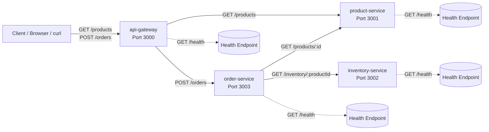

# Service-Kommunikation

Dieses Schaubild zeigt die HTTP-Kommunikation zwischen den Services.



## Abhaengigkeiten

| Service | Haengt ab von | Grund |
| --- | --- | --- |
| `api-gateway` | `product-service` | Leitet `GET /products` weiter |
| `api-gateway` | `order-service` | Leitet `POST /orders` weiter |
| `order-service` | `product-service` | Holt Produktname, Preis und Waehrung |
| `order-service` | `inventory-service` | Prueft Lagerbestand |
| `product-service` | keiner | Verwaltet Produktdaten in-memory |
| `inventory-service` | keiner | Verwaltet Lagerbestand in-memory |

## Service-URLs

Lokal:

```text
PRODUCT_SERVICE_URL=http://localhost:3001
INVENTORY_SERVICE_URL=http://localhost:3002
ORDER_SERVICE_URL=http://localhost:3003
```

Docker Compose und Kubernetes:

```text
PRODUCT_SERVICE_URL=http://product-service:3001
INVENTORY_SERVICE_URL=http://inventory-service:3002
ORDER_SERVICE_URL=http://order-service:3003
```

