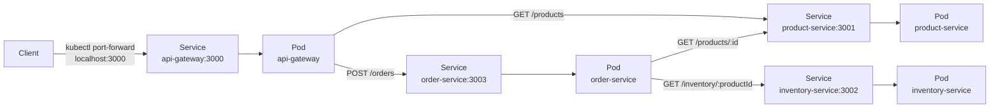

# Service-Kommunikation in Kubernetes

Kubernetes-Service-Namen wie `product-service` und `order-service` sind die
stabilen internen Netzwerkadressen. Die Pods koennen ersetzt werden, ohne dass
sich die URL fuer andere Services aendert.

